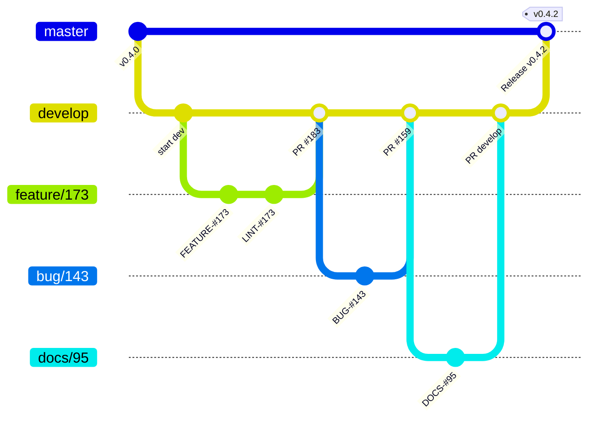

# Contributing to simple-blog-ui

## Getting Help

We use GitHub issues for tracking bugs and feature requests and have limited bandwidth to address them. If you need anything, I ask you to please follow our templates for opening issues or discussions.

- 🐛 [Bug Report](https://github.com/FernandoCelmer/simple-blog-ui/issues/new/choose)
- 📕 [Documentation](https://github.com/FernandoCelmer/simple-blog-ui/issues/new/choose)
- 🚀 [Feature Request](https://github.com/FernandoCelmer/simple-blog-ui/issues/new/choose)
- 💬 [General Question](https://github.com/FernandoCelmer/simple-blog-ui/issues/new/choose)

## Git Workflow

This project follows a **Git Flow** branching model. All development happens on the `develop` branch — never commit directly to `master`.



### Branch Naming

All branches must be created **from `develop`** and follow the pattern:

| Type | Pattern | Example | When to use |
|------|---------|---------|-------------|
| Feature | `feature/<ISSUE-NUMBER>` | `feature/173` | New functionality |
| Bug Fix | `bug/<ISSUE-NUMBER>` | `bug/143` | Fixing a reported bug |
| Documentation | `docs/<ISSUE-NUMBER>` | `docs/95` | Documentation-only changes |
| Release | `release/<VERSION>` | `release/0.5.0` | Preparing a new release |

### Creating a Branch

```bash
git checkout develop
git pull origin develop
git checkout -b feature/123
```

## Commit Style

Every commit must follow the format:

```
<emoji> <TYPE>-#<ISSUE-NUMBER>: <Description>
```

| Icon | Type      | Description                                |
|------|-----------|--------------------------------------------|
| ⚙️   | FEATURE   | New feature                                |
| 📝   | LINT      | Formatting fixes (Prettier / ESLint)       |
| 📌   | ISSUE     | Reference to issue                         |
| 🪲   | BUG       | Bug fix                                    |
| 📘   | DOCS      | Documentation changes                      |
| 📦   | NPM       | npm releases                               |
| ❤️   | TEST      | Automated tests                            |
| ⬆️   | CI/CD     | Changes in continuous integration/delivery |
| ⚠️   | SECURITY  | Security improvements                      |

### Examples

```
⚙️ FEATURE-#173: Add sb-page-layout sidebar/content grid
🪲 BUG-#143: Fix sb-carousel overlapping slides
📘 DOCS-#173: Document Blog primitives in README
📝 LINT-#173: Apply prettier to src/components
❤️ TEST-#173: Add tests for sb-sidebar nested rendering
📌 ISSUE-#173: Resolve merge conflict with develop
📦 NPM: Bump version to 0.4.2
```

## Pull Requests

### Target Branch

- Feature/bug/docs branches → open PR against **`develop`**
- Release branches → open PR against **`master`**

### PR Guidelines

When opening a PR, fill out the provided template:

1. **Description** — Summarize the changes and link the related issue
2. **Type of change** — Check the appropriate box (bug fix, feature, breaking change, docs)
3. **Checklist** — Confirm code quality, tests, and documentation

### Before Opening a PR

- [ ] Code follows the project style guidelines
- [ ] Self-review completed
- [ ] Storybook updated/added for any new component
- [ ] No new console warnings or errors
- [ ] Documentation updated (if applicable)

## Code Quality

### Storybook

Every component lives next to its `.stories.js` and `.mdx` doc page. Run Storybook locally to develop and review:

```bash
npm run storybook
```

### Build

```bash
# Library bundle (ESM + CJS, main entry + /react subpath)
npm run build

# Static Storybook site
npm run build-storybook
```

## Project Structure

```
simple-blog-ui/
├── src/
│   ├── components/        # Lit Web Components, grouped by category
│   │   ├── actions/       # button, icon-button, button-group, close-button
│   │   ├── blog/          # sidebar, page-layout, footer, prev-next, post-list, profile, error-page
│   │   ├── display/       # card, avatar, badge, tag, accordion, collapse, list-group, carousel, table
│   │   ├── feedback/      # alert, spinner, progress, toast
│   │   ├── forms/         # input, textarea, checkbox, switch
│   │   ├── layout/        # container, stack, divider
│   │   ├── navigation/    # link, tabs, nav, navbar, breadcrumb, pagination
│   │   ├── overlays/      # modal, tooltip, dropdown, offcanvas, popover
│   │   └── typography/    # heading, text, code
│   ├── react/             # @lit/react PascalCase wrappers
│   ├── styles/            # root.css (tokens), main.css, utilities.css
│   └── index.js           # Library entry point
├── examples/              # Example apps consuming simple-blog-ui
├── test/                  # Test suite
└── vite.config.js         # Multi-entry build config
```

## Development Setup

```bash
# Clone the repository
git clone https://github.com/FernandoCelmer/simple-blog-ui.git
cd simple-blog-ui

# Install dependencies
npm install

# Start Storybook
npm run storybook
```

## Summary

1. **Branch from `develop`** using the naming convention
2. **Commit** with emoji + type + issue number
3. **Open a PR** against `develop` (or `master` for releases)
4. **Pass all checks** — linting, tests, and self-review
5. Wait for code review and approval before merging
